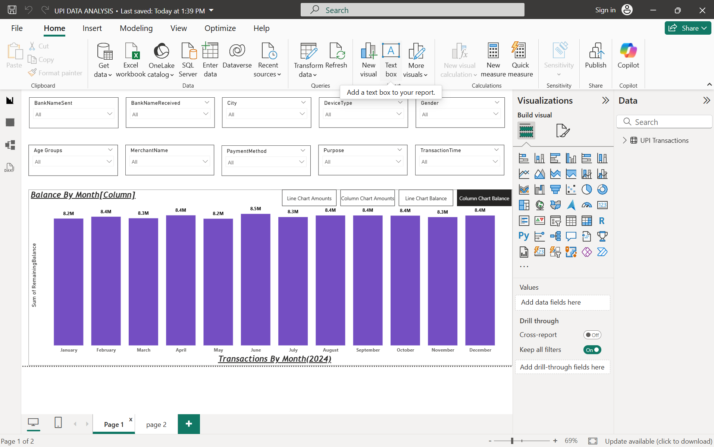

# UPI Transactions Data Analysis (Power BI)

An end-to-end Power BI data analytics project focused on profiling, cleaning, and visualizing Unified Payments Interface (UPI) transaction flows. The project turns raw transaction records into an interactive data narrative highlighting multi-currency trends, balance tracking, and consumer behaviors.

## 🚀 Project Overview & Key Features
This project tracks transactional behaviors across various dimensions (cities, merchant types, banking partners, and age groups). By utilizing advanced features like synced slicers and interactive bookmarks, users can seamlessly switch reporting perspectives between total transaction volumes and remaining bank balances.

### Key Features Installed:
* **Data Profiling:** Evaluated data quality and distribution traits to ensure clean transformations.
* **Advanced Slicing:** Structured up to 10 synchronized slicers (Age, Bank, City, Method, Purpose, etc.) across multiple report pages for deep-dive filtering.
* **Dynamic Matrix Tracking:** Built conditional-formatted matrices displaying transaction values split by city currencies and months.
* **Interactive Bookmarks:** Implemented custom navigation switches allowing toggles between *Line Chart / Column Chart* perspectives and *Transaction Amount / Remaining Balance* states.

---

## 📊 Dashboard Preview

### Page 1: Monthly Transaction & Balance Trends
Features interactive chart-switching bookmarks and top-tier categorization slicers.

### Page 2: Regional Currency & Matrix Performance Analysis
A deep-dive matrix showing cross-border currency metrics with integrated data bars.

---

## 🛠️ Project Implementation Steps

The analysis was executed systematically based on the following developmental phases:
1.  **Loading Data:** Connected and extracted the core transaction datasets into Power BI Desktop.
2.  **Data Profiling:** Inspected column quality, value distribution, and extreme anomalies.
3.  **Data Transformation:** Formatted transactional records and appended critical computed tracking structures like `Age Group` and custom text/page configurations.
4.  **Visual Configuration:** * Designed uniform, beautifully aligned KPI slicing headers.
    * Constructed core visual arrays including comprehensive **Line Charts** and multi-level **Matrix Visuals**.
5.  **User Experience Optimization:** * Synchronized slicers across both reporting environments.
    * Utilized **Conditional Formatting** (Data Bars) within matrices to emphasize high-volume months.
    * Created application-like experiences using **Bookmarks and Selection panes** to shift visual types on demand.
6.  **Deployment:** Published the completed dashboard structure to **Power BI Service** for organizational visibility.

---

## 📂 Repository Structure
* `UPI_DATA_ANALYSIS.pbix`: The core Power BI project workbook containing data models, DAX measures, and visual dashboards.
* `Screenshots/`: Image captures displaying the working interactive features.

## 🧠 Skills Demonstrated
* Data Profiling & Extract-Transform-Load (ETL)
* Data Modeling & Column Engineering 
* UI/UX Dashboard Layout Design
* Power BI Bookmarks, Selection Layers, & Button Navigation
* Advanced Slicing Matrix Construction
